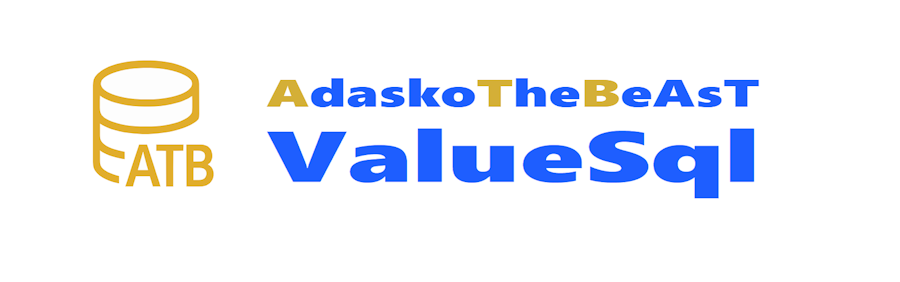

# AdaskoTheBeAsT.ValueSql

[](https://github.com/AdaskoTheBeAsT/AdaskoTheBeAsT.ValueSql)
[](https://www.nuget.org/packages/AdaskoTheBeAsT.ValueSql.SqlServer)
[](LICENSE)
[](https://dotnet.microsoft.com/)

**High-performance, source-generated data access library for .NET - faster than Dapper!**

ValueSql generates optimized mapping code at compile-time, eliminating reflection and minimizing allocations for maximum throughput.

---

## Performance

### Benchmark Environment

| Component | Specification |
|-----------|---------------|
| **CPU** | Intel Core i9-13980HX (24 cores / 32 threads) |
| **RAM** | 128 GB |
| **OS** | Windows 11 Pro (Build 26200) |
| **Runtime** | .NET 10.0.1, X64 RyuJIT AVX2 |
| **Database** | SQL Server 2022 (TestContainers) |

### Results (v0.4.0 with AXON-style Optimizations)

| Scenario | ValueSql | Dapper | EF Core | ValueSql Advantage |
|----------|----------|--------|---------|-------------------|
| **1 row** | 537 us | 748 us | 1,285 us | **28% faster** |
| **10 rows** | 693 us | 749 us | 1,285 us | **7% faster, 39% less memory** |
| **100 rows** | 912 us | 912 us | 1,463 us | Same speed, **10% less memory** |
| **1K rows** | 2,020 us | 2,344 us | 3,722 us | **14% faster** |

### Memory Allocation

| Scenario | ValueSql | Dapper | EF Core | ValueSql Advantage |
|----------|----------|--------|---------|-------------------|
| **1 row** | 5.99 KB | 6.63 KB | 87.09 KB | **10% less than Dapper** |
| **10 rows** | 6.31 KB | 10.27 KB | 92.19 KB | **39% less than Dapper** |
| **100 rows** | 43.66 KB | 48.30 KB | 131.14 KB | **10% less than Dapper** |
| **1K rows** | 353.07 KB | 360.67 KB | 530.78 KB | **2% less than Dapper** |

> Benchmarks run using BenchmarkDotNet v0.15.8 with ShortRun job.

### Optimization Techniques (from AXON Parser)

- **nint (native integers)** - Matches CPU word size, eliminates sign-extension
- **MemoryMarshal.GetArrayDataReference** - Direct array access without bounds checking
- **Unsafe.Add** - Pointer arithmetic for buffer writes
- **[SkipLocalsInit]** - Skips zeroing of local variables
- **[MethodImpl(NoInlining)]** - Keeps exception paths out of hot code

---

## Features

- **Zero Reflection** - All mapping generated at compile-time via Roslyn source generators
- **Direct Ordinal Access** - No `GetOrdinal()` calls at runtime with ordinal caching
- **Minimal Allocations** - `readonly struct` mappers, pooled buffers, `CollectionsMarshal` optimizations
- **Type-Safe** - Full IntelliSense and compile-time error checking
- **SQL Server First** - Optimized for `SqlDataReader` with fast extension methods
- **Flexible APIs** - Sync/async, buffered/streaming, single/bulk operations

---

## Installation

```bash
dotnet add package AdaskoTheBeAsT.ValueSql.SqlServer
```

For .NET 10.0+ with maximum performance:
```bash
dotnet add package AdaskoTheBeAsT.ValueSql.Runtime
```

---

## Quick Start

### 1. Define Your Model

Add the `[ValueSqlMapper]` attribute to your DTO:

```csharp
using AdaskoTheBeAsT.ValueSql.Attributes;

[ValueSqlMapper]
public class Product
{
    public int Id { get; set; }
    public string Name { get; set; } = string.Empty;
    public string? Description { get; set; }
    public decimal Price { get; set; }
    public bool IsActive { get; set; }
    public DateTime CreatedAt { get; set; }
    public Guid? ExternalId { get; set; }
}
```

### 2. Use the Generated Mapper

The source generator creates a `ProductMapper` struct with optimized mapping methods:

```csharp
await using var connection = new SqlConnection(connectionString);
await connection.OpenAsync();

await using var command = connection.CreateCommand();
command.CommandText = """SELECT Id, Name, Description, Price, IsActive, CreatedAt, ExternalId FROM Products WHERE Id = @Id""";
command.Parameters.AddWithValue("@Id", productId);

await using var reader = await command.ExecuteReaderAsync();
if (await reader.ReadAsync())
{
    var mapper = default(ProductMapper);
    var product = mapper.MapFast(reader);  // High-performance path
}
```

---

## Usage Patterns

### Single Row Query (Fastest)

```csharp
public async Task<Product?> GetByIdAsync(int id)
{
    await using var connection = new SqlConnection(_connectionString);
    await connection.OpenAsync();

    await using var command = connection.CreateCommand();
    command.CommandText = """SELECT TOP 1 * FROM Products WHERE Id = @Id""";
    command.Parameters.AddWithValue("@Id", id);

    await using var reader = await command.ExecuteReaderAsync(
        CommandBehavior.SingleResult | CommandBehavior.SingleRow);
    
    if (await reader.ReadAsync())
    {
        var mapper = default(ProductMapper);
        return mapper.MapFast(reader);
    }
    
    return null;
}
```

### Bulk Read with Buffering

```csharp
using AdaskoTheBeAsT.ValueSql.Runtime;

public async Task<List<Product>> GetAllAsync()
{
    await using var connection = new SqlConnection(_connectionString);
    await connection.OpenAsync();

    await using var command = connection.CreateCommand();
    command.CommandText = """SELECT * FROM Products""";

    await using var reader = await command.ExecuteReaderAsync();
    
    var mapper = default(ProductMapper);
    return await ValueSqlBulkReader.ReadAllBufferedAsync<Product, ProductMapper>(
        reader, mapper);
}
```

### Streaming Large Result Sets

```csharp
public async IAsyncEnumerable<Product> StreamAllAsync(
    [EnumeratorCancellation] CancellationToken ct = default)
{
    await using var connection = new SqlConnection(_connectionString);
    await connection.OpenAsync(ct);

    await using var command = connection.CreateCommand();
    command.CommandText = """SELECT * FROM Products""";

    await using var reader = await command.ExecuteReaderAsync(ct);
    
    var mapper = default(ProductMapper);
    await foreach (var product in ValueSqlBulkReader.StreamAsync<Product, ProductMapper>(
        reader, mapper, ct))
    {
        yield return product;
    }
}
```

### With Ordinal Caching (Maximum Performance)

For repeated queries, cache ordinals once for fastest mapping:

```csharp
public async Task<List<Product>> GetManyFastAsync()
{
    await using var connection = new SqlConnection(_connectionString);
    await connection.OpenAsync();

    await using var command = connection.CreateCommand();
    command.CommandText = """SELECT * FROM Products""";

    await using var reader = await command.ExecuteReaderAsync();
    
    var mapper = default(ProductMapper);
    var results = new List<Product>();
    
    if (await reader.ReadAsync())
    {
        // Cache ordinals on first row
        ProductMapper.CacheOrdinals(reader);
        results.Add(mapper.MapWithCachedOrdinals(reader));
        
        // Subsequent rows use cached ordinals
        while (await reader.ReadAsync())
        {
            results.Add(mapper.MapWithCachedOrdinals(reader));
        }
    }
    
    // Reset for different queries
    ProductMapper.ResetOrdinals();
    
    return results;
}
```

### Pagination with Total Count (NextResult Pattern)

The fastest way to get paginated data with total count is using `NextResult` - single round-trip instead of two parallel queries:

```csharp
// SQL batch: data query + count query
var sql = """
SELECT * FROM Products WHERE CategoryId = @catId
ORDER BY Id OFFSET @skip ROWS FETCH NEXT @take ROWS ONLY;
SELECT COUNT(*) FROM Products WHERE CategoryId = @catId;
""";

// Single round-trip, 20-40% faster than parallel queries
var result = await ValueSqlReader.QueryPagedAsync<Product, ProductMapper>(
    connection, sql, mapper, skip: 0, take: 50,
    cmd => cmd.Parameters.AddWithValue("@catId", categoryId));

// Result contains both data and count
Console.WriteLine($"Items: {result.Items.Count}");
Console.WriteLine($"Total: {result.TotalCount}");
Console.WriteLine($"Has more: {result.HasMore(skip)}");
Console.WriteLine($"Total pages: {result.TotalPages(pageSize)}");
```

**Why NextResult is faster than parallel queries:**

| Approach | Network Round-trips | Connections | Performance |
|----------|---------------------|-------------|-------------|
| **NextResult (recommended)** | 1 | 1 | **20-40% faster** |
| Parallel queries | 2 | 2 | Baseline |

---

## When to Use Sync vs Async

ValueSql provides both sync and async APIs. Choose based on your scenario:

### Async (Web APIs, High Concurrency)

```csharp
// Web API - use async for throughput
[HttpGet]
public async Task<IActionResult> GetProducts()
{
    var products = await ValueSqlReader.QueryPagedAsync<Product, ProductMapper>(...);
    return Ok(products);
}
```

### Sync (Background Jobs, Batch Processing)

```csharp
// Background job - use sync for speed
public void ProcessBatch()
{
    var products = ValueSqlReader.QueryPagedSync<Product, ProductMapper>(...);
    foreach (var product in products.Items) { /* ... */ }
}
```

### Decision Matrix

| Scenario | Recommendation | Why |
|----------|----------------|-----|
| **ASP.NET Core Web API** | **Async** | Throughput, thread pool efficiency |
| **gRPC Services** | **Async** | Streaming, concurrency |
| **Blazor Server** | **Async** | Don't block UI thread |
| **Background Jobs** | **Sync** | Single-threaded, max speed |
| **Console Apps** | **Sync** | No concurrency needed |
| **Batch Processing** | **Sync** | Sequential, predictable |

### Performance Comparison

| Factor | Async | Sync |
|--------|-------|------|
| Single request latency | +1-5 us overhead | **Slightly faster** |
| **Throughput under load** | **10x better** | Thread exhaustion risk |
| Thread usage during I/O | Released | Blocked |
| Memory per request | ~1 KB | ~1 MB (thread stack) |

**Bottom line:** Use **async for Web APIs** (scalability matters), **sync for background jobs** (raw speed matters).

---

## Generated Code

For a model like:

```csharp
[ValueSqlMapper]
public class Product
{
    public int Id { get; set; }
    public string Name { get; set; }
    public decimal Price { get; set; }
}
```

ValueSql generates:

```csharp
public readonly struct ProductMapper : IValueSqlMapper<Product>, IValueSqlMapperFast<Product>
{
    // Cached ordinals for maximum performance
    private static class Ordinals
    {
        public static int Id = 0;
        public static int Name = 1;
        public static int Price = 2;
        public static volatile bool IsInitialized;
    }

    [MethodImpl(MethodImplOptions.AggressiveInlining)]
    public static void CacheOrdinals(SqlDataReader reader)
    {
        if (Ordinals.IsInitialized) return;
        Ordinals.Id = reader.GetOrdinal("Id");
        Ordinals.Name = reader.GetOrdinal("Name");
        Ordinals.Price = reader.GetOrdinal("Price");
        Ordinals.IsInitialized = true;
    }

    [MethodImpl(MethodImplOptions.AggressiveInlining)]
    [SkipLocalsInit]
    public Product MapFast(SqlDataReader reader)
    {
        return new Product
        {
            Id = reader.GetInt32Fast(0),
            Name = reader.GetStringFast(1),
            Price = reader.GetDecimalFast(2)
        };
    }
    
    // ... additional methods
}
```

---

## Configuration

### Column Name Mapping

Use `[Column]` attribute for different column names:

```csharp
using System.ComponentModel.DataAnnotations.Schema;

[ValueSqlMapper]
public class Product
{
    [Column("product_id")]
    public int Id { get; set; }
    
    [Column("product_name")]
    public string Name { get; set; }
}
```

### Nullable Handling

Nullable properties are automatically handled:

```csharp
[ValueSqlMapper]
public class Product
{
    public int Id { get; set; }
    public string? Description { get; set; }  // NULL-safe
    public Guid? ExternalId { get; set; }     // NULL-safe
}
```

---

## Architecture

```
AdaskoTheBeAsT.ValueSql/
├── src/
│   ├── AdaskoTheBeAsT.ValueSql/           # Core abstractions (netstandard2.0)
│   │   ├── Abstractions/
│   │   │   └── IValueSqlMapper.cs
│   │   └── Attributes/
│   │       └── ValueSqlMapperAttribute.cs
│   │
│   ├── AdaskoTheBeAsT.ValueSql.Runtime/   # High-perf runtime (net10.0)
│   │   ├── ValueSqlBulkReader.cs          # Buffered/streaming APIs
│   │   ├── UnsafeReaderExtensions.cs      # Fast reader methods
│   │   ├── Pooling/                       # Object & list pooling
│   │   ├── Buffering/                     # ArrayBuffer, StringPool
│   │   └── Caching/                       # PreparedCommandCache
│   │
│   └── AdaskoTheBeAsT.ValueSql.SqlServer/ # SQL Server generator
│       └── SqlServerMapperGenerator.cs    # Roslyn source generator
```

---

## Why ValueSql?

| Feature | ValueSql | Dapper | EF Core |
|---------|----------|--------|---------|
| Compile-time generation | Yes | No | No |
| Zero reflection | Yes | No | No |
| Struct mappers | Yes | No | No |
| Direct SqlDataReader | Yes | No | No |
| Ordinal caching | Yes | No | N/A |
| Memory efficiency | Best | Good | Poor |

---

## Roadmap

- [x] SQL Server provider
- [x] Ordinal caching
- [x] Bulk reader APIs
- [x] Prepared statement caching
- [ ] PostgreSQL provider
- [ ] MySQL provider
- [ ] Batch command support
- [ ] SqlBulkCopy generation

---

## Contributing

Contributions are welcome! Please feel free to submit a Pull Request.

1. Fork the repository
2. Create your feature branch (`git checkout -b feature/amazing-feature`)
3. Commit your changes (`git commit -m 'Add some amazing feature'`)
4. Push to the branch (`git push origin feature/amazing-feature`)
5. Open a Pull Request

---

## License

This project is licensed under the Apache-2.0 License - see the [LICENSE](LICENSE) file for details.

---

## Acknowledgments

- Inspired by [Dapper](https://github.com/DapperLib/Dapper) - the original micro-ORM
- Architecture patterns from [AdaskoTheBeAsT.Identity.Dapper](https://github.com/AdaskoTheBeAsT/AdaskoTheBeAsT.Identity.Dapper)
- Performance techniques from .NET runtime team blogs

---

**Made with high performance in mind by [AdaskoTheBeAsT](https://github.com/AdaskoTheBeAsT)**
